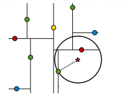

# K近邻模型(KNN)
## 一、介绍
K近邻法是一种基本的分类和回归方法，这里只介绍KNN分类算法。对新的实例分类时，根据K个最近邻的数据点的类别
通过多数表决等方式进行预测。KNN模型并没有待学习的参数，通过训练数据集将样本空间进行了一个划分，作为分类的模型。
K值得选取方面，当K值减小时，决策边界会变得复杂，容易发生过拟合；当K值增大，模型的复杂度会降低，但预测精度会降低，容易欠拟合。
实际应用中，通常采用交叉验证法来选取最优的K值。

## 二、Kd-tree
在实现KNN算法时，主要考虑如何对训练数据进行快速k近邻搜索。kd树(k-dimension tree)是一种对k维空间中的数据点进行存储以便对其进行快速检索的数据结构。
在数据点为一维的情况下，kd树就是二分查找(Binary Search Tree, BST)。

### 2.1 建立kd树

    
建立kd树的步骤如下所示：
```
1. 选取方差最大的维度作为分割维度；
2. 选择该维度的中位数作为分割点；
3. 将训练集中该维度小于中位数的划分到分割点的左子树，大于中位数的划分到分割点的右子树；
4. 重复执行步骤1-3，直至所有数据都被建立到KD Tree的节点上为止。
```
也可以不选择方差最大的维度作为分隔维度，而是循环遍历每一个维度。每次选择中位数作为分割点会产生一个平衡的k-d树。每个叶节点的高度都十分接近。
然而，**平衡的树不一定对每个应用都是最佳的**。Kd-tree实质上是对数据点所在的空间用垂直于坐标轴的超平面进行了一个**划分**。

### 2.2 最近邻搜索
最近邻搜索如果用遍历的方法，需要O(N)的时间复杂度，而使用kd-tree可以在特定的条件下对kd-tree进行剪枝(pruning)，达到降低时间复杂度的效果。
最邻近搜索用来找出在树中与输入点最接近的点，k-d树最邻近搜索(深度优先)过程如下：
1. 构造一个栈数据结构。
2. 从根节点开始，通过二叉树搜索，如果节点的分割维度值小于查找点的维度值表示查找点位于左子树中，则进入左子树，否则进入右子树，
直到达到叶子节点为止。将经过的每一个节点都加入搜索路径(压栈)。
2. 回溯搜索路径(出栈)，判断以当前节点的兄弟节点为根节点的子树中是否可能有距离搜索点更近的节点。
如果有则将该兄弟节点加入到搜索路径中(压栈)。
3. 重复3直到搜索路径为空，输出距离搜索点最近的节点。
利用kd-tree进行搜索可以形象地用下面这张图来表示：



### 2.3 K近邻搜索
用遍历的方法解决K近邻的方法即还原到基本的TopK问题，用一个维度为K的最大堆进行存储，然后遍历N个数据更新堆元素，时间复杂度是O(NlogK)(src/topk_problem有解决topK问题的代码)。
如果利用kd-tree解决，则可以利用kd-tree划分后空间的性质对kd-tree进行剪枝，不用再遍历N个数据点，时间复杂度将小于O(NlogK)。

k近邻搜索的思路是：
```
1. 首先初始化最大堆、栈（包含根节点）。
2. 最后元素出栈，通过如下方式压栈或剪枝：
    
    a. 若堆中元素小于k个，则将左右节点压栈。
    
    b. 若大于k个，用堆顶元素判断左右节点能否剪枝，若不能剪枝则压栈。
    
3. 重复2直到栈为空，最后最大堆中的k个节点，即为输入实例的k近邻点。
```     

## 三、总结
1. 可以看到，使用Kd-tree最重要的目的就是**剪枝**降低搜索空间的大小，进而降低搜索的时间复杂度。而要想更多地剪枝，应尽量降低最大堆堆顶元素的值。因此，可以先采用深度优先策略，
从根节点到搜索点的路径构造最大堆，这样可以尽快降低堆顶元素的值。然后再回溯，遍历 + 用堆顶元素剪枝。
2. 使用树这种数据结构剪枝降低搜索空间大小的技巧在很多地方都有应用，比如求解线性整数规划中的主流方法——分支定界法、强化学习中的蒙特卡罗树搜索(Monte Carlo Tree Search, MCTS)等等。

